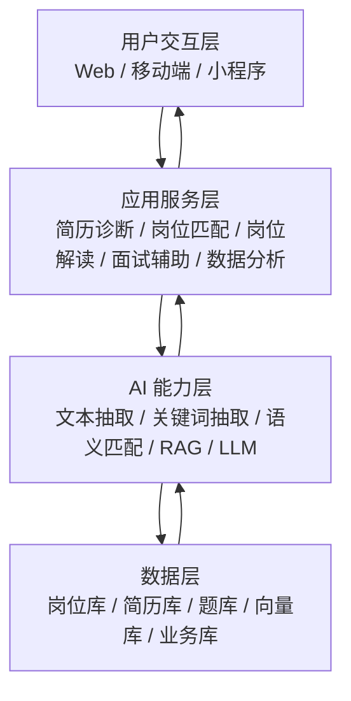

# 项目架构

本文档描述一期基础版的系统架构。当前实现优先覆盖简历诊断、岗位匹配、岗位解读、面试辅助和基础数据分析，不把完整高级能力作为一期强制目标。

## 1. 架构目标

一期架构的重点是把主链路先跑通：用户输入简历和偏好，系统完成解析、匹配、解释和建议输出，再把结果沉淀到业务数据中，支持后续统计与扩展。

设计原则如下：

- 先实现最小可用闭环，再逐步扩展。
- 业务流程清晰，结果可解释。
- 模块边界明确，便于后续替换模型和数据源。

## 2. 总体分层

系统采用四层结构：用户交互层、应用服务层、AI 能力层、数据层。



### 2.1 用户交互层

负责承载用户访问入口和结果展示，包括：

- 学生端：简历上传、岗位查看、推荐结果查看、面试题查看。
- 教师端：查看学生就业趋势与基础统计。
- 管理端：维护岗位、题库、词库和基础配置。

### 2.2 应用服务层

负责业务流程编排和接口聚合，按一期范围可拆成以下子模块：

- 简历服务：上传、解析、诊断、优化建议、版本保存。
- 岗位服务：岗位检索、画像提取、匹配排序、理由解释。
- 面试服务：岗位解读、题目推荐、参考答案生成、基础模拟问答。
- 分析服务：热词统计、薪资分布、城市对比、技能趋势。
- 管理服务：偏好设置、收藏、投递记录、日志查询。

### 2.3 AI 能力层

负责提供智能能力，主要包括：

- 文本抽取与结构化：从 PDF、Word、图片中提取简历内容。
- 关键词抽取：识别技能、项目、岗位、学历等核心标签。
- 语义匹配：计算简历画像与岗位画像的相似度。
- RAG：从题库、经验库和岗位库中检索相关内容。
- LLM：生成诊断建议、优化文案、面试题参考答案。

### 2.4 数据层

负责保存业务数据和知识数据，建议按用途区分：

- 岗位库：职位描述、地点、薪资、行业、公司信息。
- 简历库：用户上传简历、结构化结果、历史版本。
- 题库：面试题、参考答案、题目分类和来源。
- 向量库：用于语义召回和相似度检索。
- 业务库：用户信息、收藏、投递、日志和统计数据。

## 3. 一期核心模块

### 3.1 简历智能诊断与优化

输入为简历文件和目标岗位，输出为结构化简历画像、评分结果、问题提示和优化文案。重点在于发现“内容不完整、表达不专业、经历缺少量化、技能与岗位不匹配”等问题，并给出可执行修改建议。

### 3.2 岗位精准匹配

输入为简历画像、用户偏好和岗位库，输出为匹配分数、命中点、差距点和推荐理由。算法采用语义匹配加关键词匹配的混合方式，先召回再排序。

### 3.3 岗位解读与面试辅助

输入为岗位描述和公司信息，输出为结构化岗位说明、难度判断、面试题推荐和基础答案要点。该模块以“帮助学生知道该准备什么”为核心目标。

### 3.4 就业数据分析

输入为岗位库与用户行为数据，输出为热词、薪资分布、城市对比、学历要求和技能趋势等基础报表。该模块一期以统计展示为主，不强调复杂预测。

### 3.5 平台管理

负责基础的数据维护和配置能力，包括岗位导入、题库维护、词库维护、匹配权重配置和日志查看。

## 4. 一期数据流

### 4.1 简历诊断数据流

用户上传简历后，系统进行文本抽取和结构化解析，生成简历画像；随后规则与模型联合完成评分与建议生成；最后把结果返回前端，并保存诊断记录和版本信息。

### 4.2 岗位推荐数据流

用户设置目标岗位和偏好后，系统从岗位库召回候选岗位，基于匹配度进行排序，输出推荐列表和解释信息，同时记录用户的收藏和投递行为。

### 4.3 面试辅助数据流

系统基于岗位画像检索题库和经验库，生成推荐题目与答案要点，并在基础模拟问答中记录用户答题结果，用于后续优化。

## 5. 技术实现建议

一期建议采用轻量、易落地的技术组合：

- 前端：React 18 + TypeScript + Ant Design Pro，配合 ECharts 做展示。
- 后端：FastAPI，负责接口编排与业务逻辑。
- 数据库：
  - PostgreSQL 存业务数据（用户、简历、岗位、匹配记录）
  - OpenSearch 存岗位索引和向量数据（全文检索 + 语义匹配）
  - Redis 做缓存和会话管理
- 部署：
  - **一期**：Docker 和 Docker Compose 本地部署，用于开发测试和功能验证
  - **二期**：生产环境服务器部署，使用 Nginx 反向代理，支持 HTTPS 和域名访问

## 6. 详细代码架构

### 6.0 项目整体目录结构

```text
career-planning-agent/
├─ README.md                      # 项目说明
├─ REQUIREMENTS.md                # 需求分析文档
├─ ARCHITECTURE.md                # 架构设计文档
├─ SETUP.md                       # 环境搭建指南
├─ README-DOCKER-SETUP.md         # Docker 配置说明
├─ .env.example                   # 环境变量模板
├─ .gitignore                     # Git 忽略文件
├─ .dockerignore                  # Docker 忽略文件
├─ docker-compose.yml             # Docker 服务编排配置
├─ Makefile                       # 快捷命令集合
├─ LICENSE                        # 开源协议
│
├─ backend/                       # 后端代码目录
│  ├─ main.py                     # FastAPI 应用入口
│  ├─ requirements.txt            # Python 依赖清单
│  ├─ Dockerfile                  # 后端镜像构建文件
│  ├─ .env                        # 环境变量（本地，不提交）
│  ├─ pytest.ini                  # pytest 配置
│  ├─ config/                     # 配置模块
│  ├─ app/                        # 应用核心代码
│  ├─ tests/                      # 测试代码
│  └─ scripts/                    # 后端脚本
│
├─ frontend/                      # 前端代码目录
│  ├─ package.json                # Node.js 依赖清单
│  ├─ package-lock.json           # 依赖锁定文件
│  ├─ tsconfig.json               # TypeScript 配置
│  ├─ vite.config.ts              # Vite 构建配置
│  ├─ Dockerfile.dev              # 前端开发镜像
│  ├─ Dockerfile                  # 前端生产镜像
│  ├─ .eslintrc.js                # ESLint 配置
│  ├─ public/                     # 静态资源
│  ├─ src/                        # 源代码
│  └─ tests/                      # 测试代码
│
├─ deploy/                        # 部署配置目录
│  ├─ nginx.conf                  # Nginx 配置文件
│  ├─ docker-compose.prod.yml     # 生产环境 Docker 配置
│  └─ k8s/                        # Kubernetes 配置（可选）
│
├─ docker/                        # Docker 相关配置
│  └─ opensearch/                 # OpenSearch 配置
│     ├─ plugins/                 # OpenSearch 插件目录
│     └─ opensearch.yml           # OpenSearch 配置文件（可选）
│
├─ scripts/                       # 项目级脚本
│  ├─ init_db.sql                 # PostgreSQL 初始化脚本
│  ├─ init_db.py                  # 数据库初始化 Python 脚本
│  ├─ seed_data.py                # 测试数据填充脚本
│  └─ backup_db.sh                # 数据库备份脚本
│
├─ docs/                          # 项目文档目录（可选）
│  ├─ api/                        # API 文档
│  ├─ deployment/                 # 部署文档
│  └─ development/                # 开发文档
│
├─ logs/                          # 应用日志目录（运行时生成）
│  ├─ backend.log
│  ├─ error.log
│  └─ access.log
│
└─ uploads/                       # 用户上传文件目录（运行时生成）
   ├─ resumes/                    # 简历文件
   ├─ temp/                       # 临时文件
   └─ .gitkeep
```

### 6.1 后端架构（FastAPI）

```text
backend/
├─ main.py                      # 应用入口
├─ quirements.txt             # 依赖清单
├─ config/
│  ├─ __init__.py
│  ├─ settings.py              # 配置管理（数据库、Redis、LLM API）
│  └─ constants.py             # 常量定义
├─ app/
│  ├─ __init__.py
│  ├─ api/                     # API 路由层
│  │  ├─ __init__.py
│  │  ├─ v1/
│  │  │  ├─ __init__.py
│  │  │  ├─ resume.py         # 简历相关接口
│  │  │  ├─ job.py            # 岗位相关接口
│  │  │  ├─ match.py          # 匹配相关接口
│  │  │  ├─ interview.py      # 面试相关接口
│  │  │  ├─ analysis.py       # 数据分析接口
│  │  │  ├─ user.py           # 用户相关接口
│  │  │  └─ admin.py          # 管理相关接口
│  │  └─ deps.py              # 依赖注入
│  ├─ core/                    # 核心业务逻辑层
│  │  ├─ __init__.py
│  │  ├─ resume/
│  │  │  ├─ __init__.py
│  │  │  ├─ parser.py         # 简历解析器
│  │  │  ├─ diagnostician.py  # 简历诊断
│  │  │  ├─ optimizer.py      # 简历优化
│  │  │  └─ scorer.py         # 简历评分
│  │  ├─ job/
│  │  │  ├─ __init__.py
│  │  │  ├─ extractor.py      # 岗位画像提取
│  │  │  ├─ matcher.py        # 岗位匹配器
│  │  │  └─ explainer.py      # 匹配解释器
│  │  ├─ interview/
│  │  │  ├─ __init__.py
│  │  │  ├─ question_recommender.py  # 面试题推荐
│  │  │  ├─ answer_generator.py      # 答案生成
│  │  │  └─ simulator.py             # 模拟面试
│  │  └─ analysis/
│  │     ├─ __init__.py
│  │     ├─ statistics.py     # 统计分析
│  │     └─ trends.py         # 趋势分析
│  ├─ ai/                      # AI 能力层
│  │  ├─ __init__.py
│  │  ├─ llm/
│  │  │  ├─ __init__.py
│  │  │  ├─ client.py         # LLM 客户端封装
│  │  │  ├─ prompts.py        # 提示词模板
│  │  │  └─ chain.py          # LLM 调用链
│  │  ├─ nlp/
│  │  │  ├─ __init__.py
│  │  │  ├─ keyword_extractor.py    # 关键词提取
│  │  │  ├─ text_classifier.py      # 文本分类
│  │  │  └─ entity_recognizer.py    # 实体识别
│  │  ├─ embedding/
│  │  │  ├─ __init__.py
│  │  │  ├─ encoder.py        # 文本向量化
│  │  │  └─ similarity.py     # 相似度计算
│  │  ├─ rag/
│  │  │  ├─ __init__.py
│  │  │  ├─ retriever.py      # 检索器
│  │  │  └─ generator.py      # 生成器
│  │  └─ ocr/
│  │     ├─ __init__.py
│  │     └─ reader.py         # 文档 OCR
│  ├─ models/                  # 数据模型层
│  │  ├─ __init__.py
│  │  ├─ user.py              # 用户模型
│  │  ├─ resume.py            # 简历模型
│  │  ├─ job.py               # 岗位模型
│  │  ├─ match.py             # 匹配记录模型
│  │  ├─ interview.py         # 面试题模型
│  │  ├─ collection.py        # 收藏模型
│  │  ├─ application.py       # 投递记录模型
│  │  └─ log.py               # 日志模型
│  ├─ schemas/                 # Pydantic 数据验证模式
│  │  ├─ __init__.py
│  │  ├─ resume.py
│  │  ├─ job.py
│  │  ├─ match.py
│  │  ├─ interview.py
│  │  ├─ user.py
│  │  └─ common.py            # 通用响应模式
│  ├─ repositories/            # 数据访问层
│  │  ├─ __init__.py
│  │  ├─ resume_repo.py
│  │  ├─ job_repo.py
│  │  ├─ user_repo.py
│  │  ├─ match_repo.py
│  │  ├─ interview_repo.py
│  │  └─ vector_repo.py       # 向量库访问
│  ├─ services/                # 业务服务层
│  │  ├─ __init__.py
│  │  ├─ resume_service.py
│  │  ├─ job_service.py
│  │  ├─ match_service.py
│  │  ├─ interview_service.py
│  │  ├─ analysis_service.py
│  │  └─ user_service.py
│  ├─ utils/                   # 工具函数
│  │  ├─ __init__.py
│  │  ├─ file_handler.py      # 文件处理
│  │  ├─ cache.py             # 缓存工具
│  │  ├─ logger.py            # 日志工具
│  │  ├─ security.py          # 安全工具（加密、脱敏）
│  │  └─ validators.py        # 数据验证
│  └─ middleware/              # 中间件
│     ├─ __init__.py
│     ├─ auth.py              # 认证中间件
│     ├─ rate_limit.py        # 限流中间件
│     └─ cors.py              # 跨域中间件
├─ tests/                      # 测试代码
│  ├─ __init__.py
│  ├─ unit/
│  ├─ integration/
│  └─ fixtures/
└─ scripts/
   ├─ init_db.py              # 数据库初始化
   ├─ seed_data.py            # 种子数据导入
   └─ migrate.py              # 数据库迁移
```

### 6.2 前端架构（React + TypeScript）

```text
frontend/
├─ package.json
├─ tsconfig.json
├─ vite.config.ts
├─ public/
│  └─ assets/
├─ src/
│  ├─ main.tsx                # 应用入口
│  ├─ App.tsx                 # 根组件
│  ├─ router/                 # 路由配置
│  │  ├─ index.tsx
│  │  └─ routes.tsx
│  ├─ pages/                  # 页面组件
│  │  ├─ student/             # 学生端页面
│  │  │  ├─ Dashboard.tsx    # 仪表板
│  │  │  ├─ Resume/
│  │  │  │  ├─ Upload.tsx
│  │  │  │  ├─ Diagnosis.tsx
│  │  │  │  └─ History.tsx
│  │  │  ├─ Job/
│  │  │  │  ├─ Search.tsx
│  │  │  │  ├─ Detail.tsx
│  │  │  │  └─ Recommendation.tsx
│  │  │  ├─ Interview/
│  │  │  │  ├─ Questions.tsx
│  │  │  │  └─ Practice.tsx
│  │  │  ├─ Profile/
│  │  │  │  ├─ Preference.tsx
│  │  │  │  ├─ Collection.tsx
│  │  │  │  └─ Application.tsx
│  │  │  └─ Analysis/
│  │  │     └─ Market.tsx
│  │  ├─ teacher/             # 教师端页面
│  │  │  ├─ Dashboard.tsx
│  │  │  ├─ StudentOverview.tsx
│  │  │  └─ Statistics.tsx
│  │  ├─ admin/               # 管理端页面
│  │  │  ├─ Dashboard.tsx
│  │  │  ├─ JobManage.tsx
│  │  │  ├─ QuestionManage.tsx
│  │  │  ├─ DictManage.tsx
│  │  │  └─ SystemConfig.tsx
│  │  ├─ auth/
│  │  │  ├─ Login.tsx
│  │  │  └─ Register.tsx
│  │  └─ error/
│  │     ├─ NotFound.tsx
│  │     └─ ServerError.tsx
│  ├─ components/              # 通用组件
│  │  ├─ layout/
│  │  │  ├─ Header.tsx
│  │  │  ├─ Sidebar.tsx
│  │  │  └─ Footer.tsx
│  │  ├─ common/
│  │  │  ├─ Loading.tsx
│  │  │  ├─ Empty.tsx
│  │  │  ├─ ErrorBoundary.tsx
│  │  │  └─ ProtectedRoute.tsx
│  │  ├─ resume/
│  │  │  ├─ ResumeUploader.tsx
│  │  │  ├─ ResumePreview.tsx
│  │  │  ├─ DiagnosisCard.tsx
│  │  │  └─ ScoreRadar.tsx
│  │  ├─ job/
│  │  │  ├─ JobCard.tsx
│  │  │  ├─ JobFilter.tsx
│  │  │  ├─ MatchScore.tsx
│  │  │  └─ SkillTag.tsx
│  │  ├─ interview/
│  │  │  ├─ QuestionCard.tsx
│  │  │  ├─ AnswerEditor.tsx
│  │  │  └─ PracticePanel.tsx
│  │  └─ chart/
│  │     ├─ TrendChart.tsx
│  │     ├─ SalaryChart.tsx
│  │     └─ WordCloud.tsx
│  ├─ api/                     # API 请求层
│  │  ├─ client.ts            # Axios 配置
│  │  ├─ resume.ts
│  │  ├─ job.ts
│  │  ├─ match.ts
│  │  ├─ interview.ts
│  │  ├─ analysis.ts
│  │  └─ user.ts
│  ├─ stores/                  # 状态管理（Zustand 或 Redux）
│  │  ├─ useUserStore.ts
│  │  ├─ useResumeStore.ts
│  │  ├─ useJobStore.ts
│  │  └─ useAppStore.ts
│  ├─ hooks/                   # 自定义 Hooks
│  │  ├─ useAuth.ts
│  │  ├─ useUpload.ts
│  │  ├─ useDebounce.ts
│  │  └─ usePagination.ts
│  ├─ types/                   # TypeScript 类型定义
│  │  ├─ resume.ts
│  │  ├─ job.ts
│  │  ├─ match.ts
│  │  ├─ interview.ts
│  │  └─ common.ts
│  ├─ utils/                   # 工具函数
│  │  ├─ request.ts           # 请求封装
│  │  ├─ format.ts            # 格式化工具
│  │  ├─ validator.ts         # 验证工具
│  │  └─ storage.ts           # 本地存储
│  ├─ constants/               # 常量定义
│  │  ├─ routes.ts
│  │  ├─ api.ts
│  │  └─ config.ts
│  ├─ styles/                  # 样式文件
│  │  ├─ global.css
│  │  ├─ variables.css
│  │  └─ theme.ts
│  └─ assets/                  # 静态资源
│     ├─ images/
│     └─ icons/
└─ tests/
   ├─ unit/
   └─ e2e/
```

### 6.3 数据库设计

#### 6.3.1 关系型数据库表（PostgreSQL）

**用户表（users）**
```sql
CREATE TABLE users (
  id SERIAL PRIMARY KEY,
  username VARCHAR(50) UNIQUE NOT NULL,
  password_hash VARCHAR(255) NOT NULL,
  email VARCHAR(100) UNIQUE,
  phone VARCHAR(20),
  role VARCHAR(20) NOT NULL,  -- student/teacher/admin
  real_name VARCHAR(50),
  school VARCHAR(100),
  major VARCHAR(100),
  grade VARCHAR(20),
  created_at TIMESTAMP DEFAULT CURRENT_TIMESTAMP,
  updated_at TIMESTAMP DEFAULT CURRENT_TIMESTAMP
);
```

**简历表（resumes）**
```sql
CREATE TABLE resumes (
  id SERIAL PRIMARY KEY,
  user_id INT REFERENCES users(id),
  file_path VARCHAR(500),
  file_type VARCHAR(20),
  version INT DEFAULT 1,
  status VARCHAR(20),  -- draft/active/archived
  parsed_data JSONB,   -- 结构化简历数据
  diagnosis_result JSONB,  -- 诊断结果
  created_at TIMESTAMP DEFAULT CURRENT_TIMESTAMP,
  updated_at TIMESTAMP DEFAULT CURRENT_TIMESTAMP
);
```

**岗位表（jobs）**
```sql
CREATE TABLE jobs (
  id SERIAL PRIMARY KEY,
  title VARCHAR(200) NOT NULL,
  company VARCHAR(200),
  industry VARCHAR(100),
  location VARCHAR(100),
  salary_range VARCHAR(50),
  experience_required VARCHAR(50),
  education_required VARCHAR(50),
  description TEXT,
  requirements TEXT,
  job_profile JSONB,  -- 岗位画像
  status VARCHAR(20) DEFAULT 'active',
  source VARCHAR(100),  -- 数据来源
  created_at TIMESTAMP DEFAULT CURRENT_TIMESTAMP,
  updated_at TIMESTAMP DEFAULT CURRENT_TIMESTAMP
);
```

**匹配记录表（matches）**
```sql
CREATE TABLE matches (
  id SERIAL PRIMARY KEY,
  user_id INT REFERENCES users(id),
  resume_id INT REFERENCES resumes(id),
  job_id INT REFERENCES jobs(id),
  match_score DECIMAL(5,2),
  matched_skills JSONB,
  missing_skills JSONB,
  reason TEXT,
  created_at TIMESTAMP DEFAULT CURRENT_TIMESTAMP
);
```

**面试题表（interview_questions）**
```sql
CREATE TABLE interview_questions (
  id SERIAL PRIMARY KEY,
  category VARCHAR(100),  -- 技术/行为/项目等
  difficulty VARCHAR(20),  -- easy/medium/hard
  question TEXT NOT NULL,
  answer_points TEXT,
  related_skills JSONB,
  created_at TIMESTAMP DEFAULT CURRENT_TIMESTAMP
);
```

**收藏表（collections）**
```sql
CREATE TABLE collections (
  id SERIAL PRIMARY KEY,
  user_id INT REFERENCES users(id),
  job_id INT REFERENCES jobs(id),
  created_at TIMESTAMP DEFAULT CURRENT_TIMESTAMP
);
```

**投递记录表（applications）**
```sql
CREATE TABLE applications (
  id SERIAL PRIMARY KEY,
  user_id INT REFERENCES users(id),
  job_id INT REFERENCES jobs(id),
  resume_id INT REFERENCES resumes(id),
  status VARCHAR(20),  -- pending/interview/offer/rejected
  apply_date DATE,
  notes TEXT,
  created_at TIMESTAMP DEFAULT CURRENT_TIMESTAMP,
  updated_at TIMESTAMP DEFAULT CURRENT_TIMESTAMP
);
```

**系统日志表（logs）**
```sql
CREATE TABLE logs (
  id SERIAL PRIMARY KEY,
  user_id INT,
  action VARCHAR(100),
  module VARCHAR(50),
  details JSONB,
  ip_address VARCHAR(50),
  created_at TIMESTAMP DEFAULT CURRENT_TIMESTAMP
);
```

#### 6.3.2 向量数据库（Milvus/Qdrant）

**简历向量集合（resume_vectors）**
- id: 简历 ID
- vector: 简历向量（维度：768 或 1536）
- metadata: 用户 ID、技能标签、工作经验等

**岗位向量集合（job_vectors）**
- id: 岗位 ID
- vector: 岗位描述向量
- metadata: 行业、城市、薪资等

**面试题向量集合（question_vectors）**
- id: 题目 ID
- vector: 题目向量
- metadata: 分类、难度、技能等

### 6.4 核心算法流程

#### 6.4.1 简历诊断流程

```python
# 伪代码示例
def diagnose_resume(resume_file, target_job=None):
    # 1. 文本提取
    text = extract_text(resume_file)
    
    # 2. 结构化解析
    parsed = parse_resume(text)
    
    # 3. 评分（多维度）
    scores = {
        'completeness': score_completeness(parsed),
        'professionalism': score_professionalism(parsed),
        'quantification': score_quantification(parsed),
        'project_depth': score_project_depth(parsed),
        'skill_match': score_skill_match(parsed, target_job) if target_job else 0
    }
    
    # 4. 生成优化建议
    suggestions = generate_suggestions(parsed, scores)
    
    # 5. 返回结果
    return {
        'parsed_data': parsed,
        'scores': scores,
        'suggestions': suggestions,
        'overall_score': calculate_overall_score(scores)
    }
```

#### 6.4.2 岗位匹配流程

```python
# 伪代码示例
def match_jobs(resume_profile, user_preferences, top_k=20):
    # 1. 候选召回（向量检索 + 规则筛选）
    vector_candidates = vector_search(resume_profile.embedding, top_k=100)
    rule_candidates = rule_filter(user_preferences)
    candidates = merge_candidates(vector_candidates, rule_candidates)
    
    # 2. 精排序（混合打分）
    scored_jobs = []
    for job in candidates:
        semantic_score = calculate_semantic_similarity(resume_profile, job)
        keyword_score = calculate_keyword_match(resume_profile, job)
        preference_score = calculate_preference_match(job, user_preferences)
        
        final_score = (
            0.4 * semantic_score +
            0.4 * keyword_score +
            0.2 * preference_score
        )
        
        scored_jobs.append({
            'job': job,
            'score': final_score,
            'matched_skills': extract_matched_skills(resume_profile, job),
            'missing_skills': extract_missing_skills(resume_profile, job)
        })
    
    # 3. 生成推荐理由
    for item in scored_jobs[:top_k]:
        item['reason'] = generate_match_reason(
            resume_profile, 
            item['job'], 
            item['matched_skills']
        )
    
    # 4. 分层返回
    return {
        'high_match': [j for j in scored_jobs if j['score'] >= 0.8][:10],
        'medium_match': [j for j in scored_jobs if 0.6 <= j['score'] < 0.8][:10],
        'potential': [j for j in scored_jobs if j['score'] < 0.6][:5]
    }
```

#### 6.4.3 面试题推荐流程

```python
# 伪代码示例
def recommend_interview_questions(job_profile, top_k=10):
    # 1. 提取岗位关键技能
    key_skills = extract_key_skills(job_profile)
    
    # 2. 从题库检索相关题目
    questions = []
    for skill in key_skills:
        skill_questions = search_questions_by_skill(skill, top_k=5)
        questions.extend(skill_questions)
    
    # 3. 去重排序
    questions = deduplicate(questions)
    questions = sort_by_relevance(questions, job_profile)
    
    # 4. 生成答案要点（LLM）
    for q in questions[:top_k]:
        q['answer_points'] = generate_answer_points(q, job_profile)
    
    return questions[:top_k]
```

### 6.5 核心模块接口设计

#### 6.5.1 简历相关接口

- `POST /api/v1/resume/upload` - 上传简历
- `POST /api/v1/resume/parse` - 解析简历
- `POST /api/v1/resume/diagnose` - 诊断简历
- `GET /api/v1/resume/{id}` - 获取简历详情
- `GET /api/v1/resume/list` - 获取简历列表
- `PUT /api/v1/resume/{id}` - 更新简历
- `DELETE /api/v1/resume/{id}` - 删除简历

#### 6.5.2 岗位相关接口

- `GET /api/v1/job/list` - 获取岗位列表
- `GET /api/v1/job/{id}` - 获取岗位详情
- `POST /api/v1/job/search` - 搜索岗位
- `POST /api/v1/job/recommend` - 岗位推荐
- `POST /api/v1/job/parse` - 解析岗位画像

#### 6.5.3 匹配相关接口

- `POST /api/v1/match/calculate` - 计算匹配度
- `GET /api/v1/match/history` - 获取匹配历史
- `POST /api/v1/match/explain` - 解释匹配原因

#### 6.5.4 面试相关接口

- `POST /api/v1/interview/recommend-questions` - 推荐面试题
- `POST /api/v1/interview/generate-answer` - 生成答案要点
- `POST /api/v1/interview/simulate` - 模拟面试

#### 6.5.5 分析相关接口

- `GET /api/v1/analysis/market-trends` - 市场趋势
- `GET /api/v1/analysis/salary-distribution` - 薪资分布
- `GET /api/v1/analysis/skill-ranking` - 技能排行
- `GET /api/v1/analysis/city-comparison` - 城市对比

## 7. 推荐目录结构

```text
project-root/
├─ README.md
├─ REQUIREMENTS.md
├─ ARCHITECTURE.md
├─ .env.example              # 环境变量模板
├─ .dockerignore             # Docker 忽略文件
├─ docker-compose.yml        # Docker 服务编排
├─ Makefile                  # 快捷命令
├─ frontend/                 # 前端代码
├─ backend/                  # 后端代码
├─ docs/                     # 文档目录（可选）
├─ scripts/                  # 脚本文件
│  └─ init_db.sql           # 数据库初始化脚本
├─ deploy/                   # 部署配置
│  └─ nginx.conf            # Nginx 配置文件
├─ docker/                   # Docker 相关配置
│  └─ opensearch/           # OpenSearch 配置
│     └─ plugins/           # OpenSearch 插件目录
├─ logs/                     # 应用日志目录（运行时生成）
└─ uploads/                  # 用户上传文件目录（运行时生成）
```

## 8. 扩展方向（二期目标）

一期完成后，可逐步增加以下能力：

### 8.1 功能扩展
- 更完整的模拟面试与反馈体系。
- 更细粒度的就业趋势报告和学院维度分析。
- 更复杂的算法调优、内容运营和学校管理看板。
- 更完整的权限分级、内容安全和审计能力。
- 多模型切换、推理过程追溯与更细粒度安全管控。

### 8.2 部署升级
- **生产环境服务器部署**：
  - 部署到云服务器（阿里云/腾讯云/学校服务器）
  - 配置域名和 HTTPS 证书
  - 使用 `deploy/docker-compose.prod.yml` 生产配置
  - 配置 CI/CD 自动部署流水线
  - 添加监控告警（Prometheus + Grafana）
  - 数据库主从复制和定期备份
  - 负载均衡和高可用性配置

## 9. 小结

这套架构的核心思路是：

**一期**：先用简历诊断和岗位匹配打通主流程，再用岗位解读、面试辅助和基础分析形成闭环。在本地 Docker 环境中完成开发、测试和功能验证。

**二期**：在一期功能基础上，部署到生产服务器，提供在线服务供全校师生访问，同时扩展更完整的就业指导平台功能。
