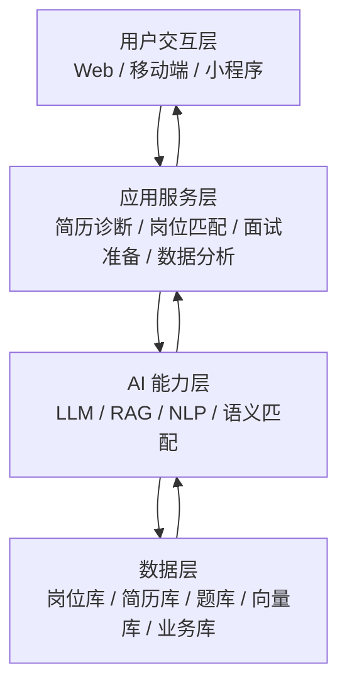

# 智慧学工职业规划推荐智能体

> 面向高校就业指导场景的一期基础版智能求职服务平台，以简历诊断、岗位匹配和面试准备为主线，先打通最小可用闭环。

[](LICENSE)

## 项目说明

本项目围绕高校毕业生求职中的核心痛点展开：简历不知道怎么改、岗位不知道怎么选、面试不知道怎么准备、市场趋势不知道怎么看。当前文档版本以基础任务为准，不再把全部高级能力都当作一期必须完成的内容。

### 一期目标

- 支持简历上传、基础解析、诊断评分和优化建议。
- 支持岗位画像提取、基础匹配推荐和匹配理由说明。
- 支持岗位解读、面试题推荐和基础问答辅助。
- 支持基础就业数据分析与可视化展示。
- 支持用户偏好、收藏、投递记录等基础管理能力。

### 角色定位

- 学生用户：进行简历优化、岗位筛选、面试准备和投递记录管理。
- 就业指导老师：查看学生就业情况和岗位趋势，用于指导。
- 平台管理员：维护岗位库、题库、词库和基础配置。

## 需求文档

- 需求分析文档： [REQUIREMENTS.md](REQUIREMENTS.md)
- 系统架构文档： [ARCHITECTURE.md](ARCHITECTURE.md)

## 一期功能范围

### 1. 简历智能诊断与优化

- 支持 PDF、Word、图片等简历格式的基础解析。
- 提取基本信息、教育经历、实习经历、项目经验、技能标签。
- 输出完整性、专业性、量化程度、项目深度、岗位匹配等评分。
- 给出可执行的修改建议和面向岗位的优化文案。
- 支持简历版本保存，便于后续投递使用。

### 2. 岗位精准匹配

- 将简历画像与岗位描述进行混合匹配。
- 输出匹配度分数、命中技能、缺失技能和推荐理由。
- 支持行业、城市、薪资、公司性质等偏好筛选。
- 支持分层推荐，区分高度匹配、较为匹配和发展方向。

### 3. 岗位解读与面试准备

- 自动提炼岗位的学历、经验、技能、地点、薪资等关键信息。
- 给出岗位难度的基础判断。
- 推荐高频面试题和参考答案要点。
- 支持基础模拟问答与答题反馈。

### 4. 就业数据分析

- 展示岗位热词、技能趋势和薪资分布。
- 支持城市、行业、学历等维度的基础对比。
- 输出岗位 Top 技能排行和趋势变化。

### 5. 平台管理

- 支持岗位数据管理与题库管理。
- 支持基础词库维护与匹配权重配置。
- 支持系统日志和运行记录查询。

## 系统架构

项目采用四层结构：用户交互层、应用服务层、AI 能力层、数据层。



### 架构说明

- 用户交互层负责页面、表单和结果展示。
- 应用服务层负责业务流程编排和接口聚合。
- AI 能力层负责文本解析、检索增强生成、语义匹配和内容生成。
- 数据层负责保存岗位、简历、题库、推荐记录和统计数据。

## 技术栈

### 前端

- React 18 或 Vue 3
- Ant Design 或 Element Plus
- ECharts

### 后端

- FastAPI 或 Spring Boot
- PostgreSQL 或 MySQL
- MongoDB
- Redis

### AI 能力

- 大语言模型 API
- 向量检索组件
- 关键词抽取与文本结构化
- RAG 检索增强生成

### 部署

- Docker / Docker Compose
- Nginx

## 推荐目录结构

```text
project-root/
├─ README.md
├─ REQUIREMENTS.md
├─ ARCHITECTURE.md
├─ backend/
├─ frontend/
├─ docs/
├─ scripts/
└─ deploy/
```

## 快速开始

1. 克隆仓库。
2. 配置环境变量。
3. 安装前后端依赖。
4. 初始化数据库和基础数据。
5. 启动前后端服务。

如果当前仓库还没有完整代码工程，可以先把需求文档和架构文档作为项目交付依据，再按一期范围逐步补代码。
