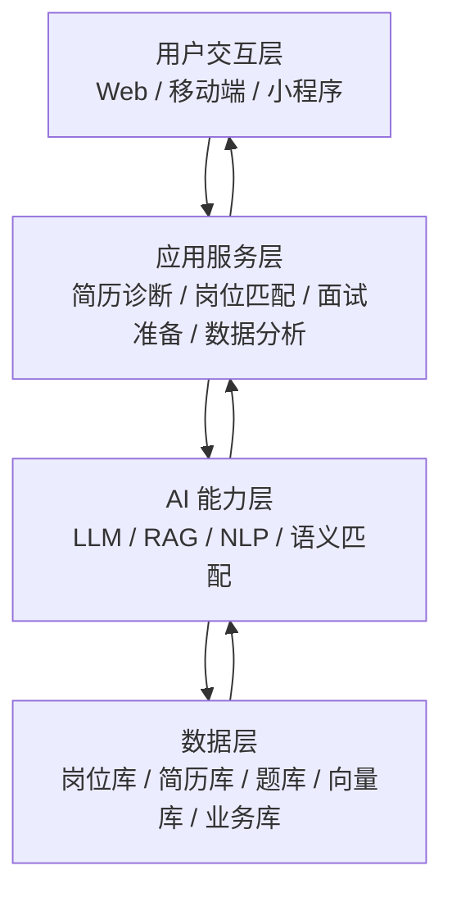

# 智慧学工职业规划推荐智能体

> 面向高校就业指导场景的智能求职服务平台，以简历诊断、岗位匹配和面试准备为主线，帮助学生提升求职效率。

[](LICENSE)

## 项目说明

本项目围绕高校毕业生求职中的核心痛点展开：简历不知道怎么改、岗位不知道怎么选、面试不知道怎么准备、市场趋势不知道怎么看。采用分期实施策略，先完成核心功能的最小可用闭环，再逐步扩展。

### 一期目标（本地开发测试）

- ✅ 支持简历上传、基础解析、诊断评分和优化建议
- ✅ 支持岗位画像提取、基础匹配推荐和匹配理由说明
- ✅ 支持岗位解读、面试题推荐和基础问答辅助
- ✅ 支持基础就业数据分析与可视化展示
- ✅ 支持用户偏好、收藏、投递记录等基础管理能力
- ✅ **本地 Docker 环境部署，完成功能开发和测试验证**

### 二期目标（生产服务部署）

- ⬜ 更完整的模拟面试系统和经验库
- ⬜ 更细粒度的就业趋势报告和学院维度分析
- ⬜ 更完整的权限分级和审计能力
- ⬜ **生产环境服务器部署，提供在线服务供全校师生访问**
- ⬜ 配置监控告警、数据备份和高可用性

### 用户角色

- **学生用户**：进行简历优化、岗位筛选、面试准备和投递记录管理
- **就业指导老师**：查看学生就业情况和岗位趋势，用于指导
- **平台管理员**：维护岗位库、题库、词库和基础配置

## 📚 文档导航

### 需求和架构
- [REQUIREMENTS.md](REQUIREMENTS.md) - 需求分析文档
- [ARCHITECTURE.md](ARCHITECTURE.md) - 系统架构设计

### 环境搭建
- [SETUP.md](SETUP.md) - **本地开发环境搭建指南（一期）**
- [README-DOCKER-SETUP.md](README-DOCKER-SETUP.md) - Docker 配置说明
- [deploy/README-PRODUCTION.md](deploy/README-PRODUCTION.md) - 生产环境部署指南（二期）

## 一期功能范围

### 1. 简历智能诊断与优化

- 支持 PDF、Word、图片等简历格式的基础解析。
- 提取基本信息、教育经历、实习经历、项目经验、技能标签。
- 输出完整性、专业性、量化程度、项目深度、岗位匹配等评分。
- 给出可执行的修改建议和面向岗位的优化文案。
- 支持简历版本保存，便于后续投递使用。

### 2. 岗位精准匹配

- 将简历画像与岗位描述进行混合匹配。
- 输出匹配度分数、命中技能、缺失技能和推荐理由。
- 支持行业、城市、薪资、公司性质等偏好筛选。
- 支持分层推荐，区分高度匹配、较为匹配和发展方向。

### 3. 岗位解读与面试准备

- 自动提炼岗位的学历、经验、技能、地点、薪资等关键信息。
- 给出岗位难度的基础判断。
- 推荐高频面试题和参考答案要点。
- 支持基础模拟问答与答题反馈。

### 4. 就业数据分析

- 展示岗位热词、技能趋势和薪资分布。
- 支持城市、行业、学历等维度的基础对比。
- 输出岗位 Top 技能排行和趋势变化。

### 5. 平台管理

- 支持岗位数据管理与题库管理。
- 支持基础词库维护与匹配权重配置。
- 支持系统日志和运行记录查询。

## 系统架构

项目采用四层结构：用户交互层、应用服务层、AI 能力层、数据层。



### 架构说明

- 用户交互层负责页面、表单和结果展示。
- 应用服务层负责业务流程编排和接口聚合。
- AI 能力层负责文本解析、检索增强生成、语义匹配和内容生成。
- 数据层负责保存岗位、简历、题库、推荐记录和统计数据。

## 🛠️ 技术栈

### 前端
- React 18 + TypeScript
- Ant Design Pro
- Vite
- ECharts

### 后端
- FastAPI 0.139.0
- Python 3.10.20
- Pydantic 2.13.4
- SQLAlchemy 2.0.51

### 数据库
- PostgreSQL 15（关系型数据库）
- OpenSearch 2.11.1（搜索引擎 + 向量检索 + IK 中文分词）
- Redis 7.2（缓存和会话管理）

### AI 能力
- 国内 LLM API（通义千问/智谱/DeepSeek/月之暗面）
- OpenSearch k-NN 向量检索
- 语义匹配和 RAG 检索增强生成

### 部署
- **一期**：Docker Compose 本地部署
- **二期**：生产服务器 + Nginx 反向代理 + HTTPS

## 📁 项目结构

```text
career-planning-agent/
├─ README.md                      # 项目说明（本文件）
├─ REQUIREMENTS.md                # 需求分析文档
├─ ARCHITECTURE.md                # 架构设计文档
├─ SETUP.md                       # 环境搭建指南
├─ .env.example                   # 环境变量模板
├─ docker-compose.yml             # Docker 开发环境配置
├─ Makefile                       # 快捷命令
├─ backend/                       # 后端代码
│  ├─ main.py                     # FastAPI 应用入口
│  ├─ requirements.txt            # Python 依赖
│  ├─ Dockerfile                  # 后端镜像
│  ├─ config/                     # 配置模块
│  └─ app/                        # 应用代码
├─ frontend/                      # 前端代码
│  ├─ src/                        # 源代码
│  ├─ package.json                # Node 依赖
│  └─ Dockerfile.dev              # 前端开发镜像
├─ deploy/                        # 部署配置
│  ├─ nginx.conf                  # Nginx 配置
│  ├─ docker-compose.prod.yml     # 生产环境配置
│  └─ README-PRODUCTION.md        # 生产部署指南
├─ scripts/                       # 脚本文件
│  └─ init_db.sql                 # 数据库初始化
├─ docker/                        # Docker 相关
├─ logs/                          # 日志目录
└─ uploads/                       # 上传文件目录
```

## 🚀 快速开始

### 前置要求
- Docker Desktop 29.6.1+
- Python 3.10.20
- Node.js 22.14.0
- Git

### 1. 克隆仓库
```bash
git clone https://github.com/your-repo/career-planning-agent.git
cd career-planning-agent
```

### 2. 配置环境变量
```bash
# 复制环境变量模板
cp .env.example backend/.env

# 编辑配置文件，修改以下必需项：
# - LLM_API_KEY（LLM API 密钥）
# - EMBEDDING_API_KEY（Embedding API 密钥）
# - JWT_SECRET_KEY（JWT 密钥）
vim backend/.env
```

### 3. 启动开发环境
```bash
# 启动所有服务
make up

# 或使用 docker-compose
docker-compose up -d

# 查看服务状态
make status
```

### 4. 安装 OpenSearch IK 分词器
```bash
# 等待 OpenSearch 启动后（约 30 秒）
make opensearch-ik
```

### 5. 访问服务
- **后端 API 文档**: http://localhost:8000/docs
- **前端开发服务器**: http://localhost:5173
- **OpenSearch Dashboards**: http://localhost:5601
- **Nginx 反向代理**: http://localhost:80

详细步骤请查看 [SETUP.md](SETUP.md)

## 📖 常用命令

```bash
# 查看所有可用命令
make help

# 启动服务
make up

# 停止服务
make down

# 查看日志
make logs

# 进入后端容器
make shell-backend

# 运行测试
make test

# 数据库操作
make init-db
make backup
```

## 🔧 开发指南

### 后端开发
1. 后端代码在 `backend/` 目录
2. 修改代码后自动热重载
3. API 文档: http://localhost:8000/docs

### 前端开发
1. 前端代码在 `frontend/` 目录
2. 修改代码后自动热重载
3. 访问: http://localhost:5173

### 数据库
- PostgreSQL: `localhost:5432`
- Redis: `localhost:6379`
- OpenSearch: `http://localhost:9200`

## 📦 二期部署

二期将部署到生产服务器，提供在线服务。详细指南请查看：
- [deploy/README-PRODUCTION.md](deploy/README-PRODUCTION.md)

## 📝 许可证

本项目采用 MIT 许可证 - 详见 [LICENSE](LICENSE) 文件

## 🤝 贡献

欢迎提交 Issue 和 Pull Request！

## 📮 联系方式

如有问题，请联系项目团队。
